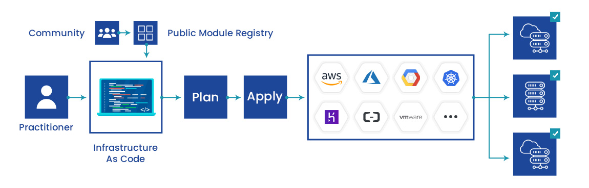
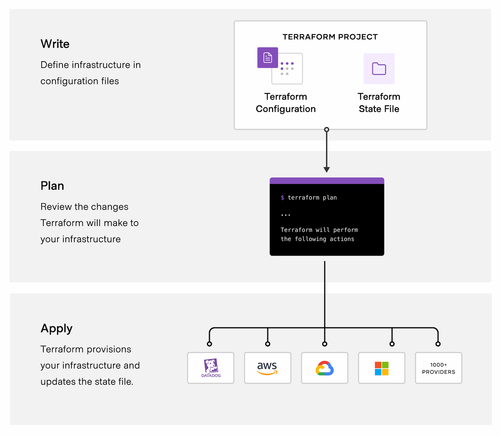

# Terraform Overview

# 1 Foundations

## 1.1 What is Terraform?

**Terraform** is an **open-source Infrastructure as Code (IaC)** tool developed by **HashiCorp**.  

It allows you to **define, provision, update, and destroy infrastructure** using **declarative configuration files**, instead of manually creating resources via cloud consoles or GUIs.



Terraform works across **multiple cloud providers and services**, making it a **cloud-agnostic orchestration tool**.

> **The Core Concept:**  
> Terraform lets you manage infrastructure the same way you manage application code.

---

## 1.2 What is Infrastructure as Code (IaC)?

**Infrastructure as Code (IaC)** is the practice of managing infrastructure using **machine-readable configuration files** rather than manual processes.



Instead of:
- Clicking buttons in cloud consoles  
- Manually creating resources  
- Relying on undocumented steps  

You **describe the desired infrastructure in code**, and tools like Terraform ensure reality matches that description.

### IaC Enables You To:
- Build infrastructure in a **safe, consistent, and repeatable** way  
- Store infrastructure definitions in **version control (Git)**  
- **Reuse and share** infrastructure configurations  
- Apply changes predictably across **dev, staging, and production**  
- Recover quickly from failures using reproducible definitions  

## 1.3 The Problem vs. The Solution

### The Old Way (Manual Infrastructure)

Before IaC, infrastructure was created manually. This led to:

- ❌ **Configuration Drift:** Environments (Dev vs Prod) diverged silently  
- ❌ **Human Errors:** Clicking the wrong option caused outages  
- ❌ **No Audit Trail:** No visibility into who changed what  
- ❌ **Difficult Rollbacks:** Undoing changes was risky and slow  

### The Terraform Way

Terraform solves these problems by:
- Treating infrastructure as **code**
- Making infrastructure **predictable**
- Bridging **intent (code)** with **reality (cloud)**

---

## 1.4 Why Terraform and Not Something Else?

| Tool | Focus | Limitations |
|---|---|---|
| **Terraform** | **Multi-cloud IaC** | Requires state management |
| CloudFormation | AWS-only | Vendor lock-in |
| Bicep / ARM | Azure-only | Vendor lock-in |
| Pulumi | IaC with programming languages | Higher learning curve |
| Ansible | OS configuration management | Not ideal for provisioning |

**Terraform excels at provisioning infrastructure across clouds.**

---

# 2 Architecture & Workflow

## 2.1 High-Level Architecture

Terraform is a translation engine between your intent and cloud APIs.


**Key Components:**

* **Terraform Core:** Builds dependency graphs and execution plans
* **Providers:** Translate Terraform syntax into cloud API calls
* **State File:** Maps Terraform resources to real infrastructure

---

## 2.2 The Lifecycle (Workflow)

Terraform follows a safe and deterministic lifecycle.



### Command Breakdown

1. **terraform init**

   * Downloads providers
   * Initializes backend and state

2. **terraform plan**

   * Dry run of changes
   * Shows Add / Change / Destroy

3. **terraform apply**

   * Executes the plan
   * Provisions resources

4. **terraform destroy**

   * Cleanly removes infrastructure

# 3 Enterprise Strategy

## 3.1 Real-World Use Cases

1. **Multi-Environment Parity**

   * Same code for Dev, Staging, Prod using variables

2. **Disaster Recovery**

   * Redeploy infrastructure in minutes in a new region

3. **Ephemeral Environments**

   * Temporary environments for PRs and testing

## 3.2 Enterprise Best Practices

### 1️⃣ Remote State is Mandatory

Never store `terraform.tfstate` locally in teams.

* Use **S3 + DynamoDB locking** or **Terraform Cloud**

### 2️⃣ Modularization

* Avoid monolithic `main.tf`
* Create reusable **modules**

### 3️⃣ CI/CD Integration

* No manual `terraform apply` in production
* Pipeline: commit → plan → approve → apply

### 4️⃣ Secrets Management

* Never hardcode secrets
* Use variables, Vault, or cloud secret managers


# 4 Production Terraform Template

## Standard Repository Structure

```text
terraform-project/
├── modules/
│   ├── networking/
│   ├── compute/
│   └── database/
│
├── environments/
│   ├── dev/
│   │   ├── main.tf
│   │   ├── variables.tf
│   │   ├── outputs.tf
│   │   └── terraform.tfvars
│   └── prod/
│       ├── main.tf
│       ├── variables.tf
│       ├── outputs.tf
│       └── terraform.tfvars
│
├── .gitignore
├── README.md
└── pipeline.yaml
```

### Why This Works

* **Isolation:** Separate states per environment
* **Reusability:** Logic in modules, values in environments

# Final Cloud Engineering Insight

> **Terraform doesn’t replace the cloud console — it replaces the risk of using it.**

Terraform provides:

* Control
* Visibility
* Automation
* Confidence